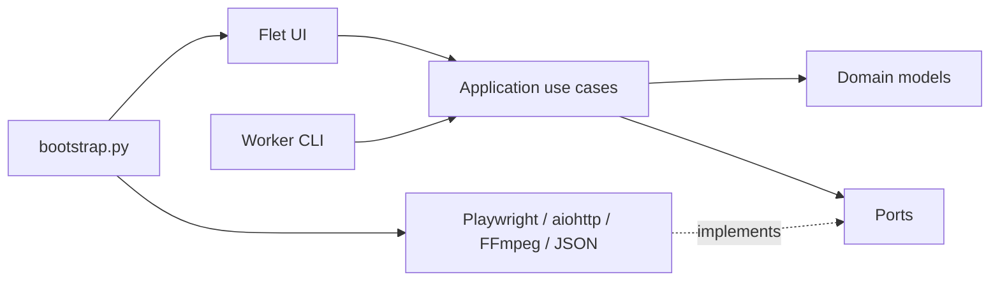

# Architecture

GetCourse Video Downloader — модульный монолит с направленными зависимостями.
Архитектура отделяет бизнес-сценарии от Flet, Playwright, сети и файловой системы,
но не усложняет desktop-приложение микросервисами.

## Слои

### Domain

`src/getcourse_downloader/domain`

Содержит неизменяемые модели `Course`, `Lesson`, `DownloadRequest`, события worker’а
и ошибки. Здесь запрещены импорты Flet, Playwright, aiohttp, subprocess и storage.

### Application

`src/getcourse_downloader/application`

Содержит use cases и `Protocol`-порты. Application знает, что нужно выполнить, но
не знает, как открыть Firefox, прочитать JSON или запустить дочерний процесс.

### Infrastructure

`src/getcourse_downloader/infrastructure`

Реализует порты:

- GetCourse discovery и перехват Rutube master playlist через Playwright;
- HLS-загрузка и FFmpeg muxing;
- атомарные JSON repositories;
- platform-specific paths;
- subprocess worker client.

### Presentation

`src/getcourse_downloader/presentation`

Flet screens разделены на `view`, `controller`, `state` и `components`. CLI содержит
worker, discovery и live-browser entrypoints. Presentation отображает domain events,
но не разбирает текстовые логи для принятия решений.

### Composition root

`bootstrap.py` — единственное место, где конкретные adapters соединяются с use cases.
Точки входа не создают зависимости внутри экранов.

## Основные потоки

### Получение курсов

1. `StartScreen` вызывает `StartController`.
2. `DiscoverCourses` проверяет URL.
3. `GetCourseDiscoverer` выполняет авторизацию и парсинг.
4. `JsonCourseRepository` атомарно сохраняет совместимый `courses.json`.

### Загрузка

1. `CoursesScreen` создаёт типизированный `DownloadRequest`.
2. `SubprocessDownloadGateway` запускает тот же EXE с `--download-worker`.
3. Worker собирает in-process adapters через собственный composition root.
4. События передаются в UI как JSON Lines.
5. MP4 сначала создаётся как `.part`, затем атомарно перемещается на итоговый путь.

## Инварианты

- Domain и application не импортируют outer layers. Это проверяет
  `tests/test_architecture.py`.
- Master playlist описывает варианты качества, а не список уроков.
- Неполный набор HLS-сегментов не считается успешным видео.
- Runtime-данные не записываются рядом с EXE.
- UI-текст не является межпроцессным API.
- Все зависимости собираются из `pyproject.toml` и фиксируются в `uv.lock`.

## Проверка изменений

Статические тесты не заменяют runtime-проверку. Изменения Playwright, Flet, HLS или
packaging требуют проверки реального входа, выбора уроков, загрузки видео и готового
Windows EXE.
