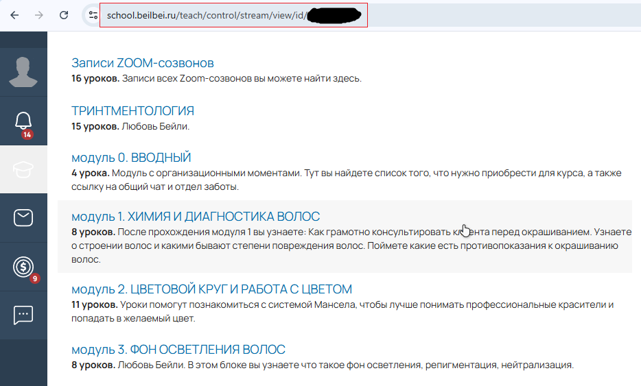

# GetCourseVideoDownloader

Универсальный инструмент для загрузки видео с образовательной платформы **GetCourse**.  
Поддерживает как **автоматический**, так и **ручной** режим работы: можно полностью автоматизировать процесс скачивания,  
или выполнять действия вручную при необходимости.

Подходит для тех, кто хочет организовать офлайн-доступ к своим обучающим материалам с GetCourse.


## Особенности

- Асинхронная загрузка сегментов видео 🚀  
- Поддержка различных качеств (**360p–1080p**) 🎞️  
- Автоматический вход через **Playwright**   
- Сохранение **cookie** для повторного входа без авторизации 🍪  
- Сохранение структуры курсов и видеофайлов по папкам 📁  
- Работа с настройками через **.env** ⚙️  
- Автоматическое поочередное скачивание всех видеоуроков 🧠  
- Перехват и отслеживание сетевых запросов плеера (**m3u8**) с последующей автоматической загрузкой видео 🛰️  

## Требования

- **Windows 10/11**  
- **Python 3.12**  
- **FFmpeg** (должен быть добавлен в `PATH`)  

## Установка (только для Windows)

1. **Клонируй репозиторий:**
   ```bash
   git clone https://github.com/byMarken/GetCourseVideoDownloader.git
   1
   ```
2. **Установи зависимости:**

   Убедись, что находишься в папке проекта, затем выполни команду:
   ```bash
   pip install -r req.txt
   ```

3. Убедитесь, что FFmpeg установлен и доступен в системном PATH или находится в одной папке со скриптом.

## Установка FFmpeg

Скрипту нужен установленный FFmpeg (должен быть доступен в `PATH` ). Проверить установку можно командой `ffmpeg -version`.

### Windows

Самый простой путь — через пакетный менеджер **winget** (Windows 10/11):

```powershell
winget install --id Gyan.FFmpeg -e
```
Ручная установка (zip-архив): скачайте сборку FFmpeg для Windows со страницы загрузок FFmpeg (раздел Windows builds), распакуйте и добавьте папку bin в переменную окружения PATH.


## 🚀 Использование (автоматический режим)

### 1. Настрой файл `.env`

Перед запуском укажи параметры в файле `.env`:

| Параметр | Описание                                                                                                                       |
|-----------|--------------------------------------------------------------------------------------------------------------------------------|
| **QUALITY** | Качество загружаемого видео. Возможные значения: `1080`, `720`, `480`, `360` или `auto` (автоматический выбор лучшего качества). |
| **HEADLESS** | `False` — браузер видимый, можно наблюдать процесс; `True` — скрытый режим без окна браузера.                                  |
| **MAX_PARALLEL_DOWNLOADS** | Количество одновременно загружаемых сегментов. Оптимум — `4`.                                                                  |
| **COURSES_SAVE_PATH** | Путь к папке, где будут сохраняться видео. Например:`E:\Downloads\Courses`.                                      |
| **PLAYLIST_URL** | Ссылка на страницу с уроками (stream) GetCourse. Пример: `https://school.beilbei.ru/teach/control/stream/view/id/343098743`.  |

Пример `.env`:
```env
QUALITY=auto
HEADLESS=False
MAX_PARALLEL_DOWNLOADS=4
COURSES_SAVE_PATH=C:\GetCourses
PLAYLIST_URL=https://school.beilbei.ru/teach/control/stream/view/id/343098743
```

### 2. 📚 Собери список курсов

Выполни команду:
```bash
python givelinks.py
```
> ⚠️ **Внимание:**  
> При первом запуске скрипта потребуется авторизация на платформе **GetCourse**.  
> После входа данные сохраняются в папке `session_data`, и повторная авторизация больше не понадобится (Но сессия может вылететь) 
>  
> Если используется параметр `HEADLESS=True`, окно браузера будет скрыто —  
> для первой авторизации установи `HEADLESS=False`.

После авторизации потребуется ручной перезапуск givelinks.py


### 3. 🎬 Скачай видеоуроки

После успешного создания `courses.json` запусти:
```bash
python givereq.py
```

### ГОТОВО!
#### Видео будут загружаться в указанную папку.
Скоро допишу README.md...


